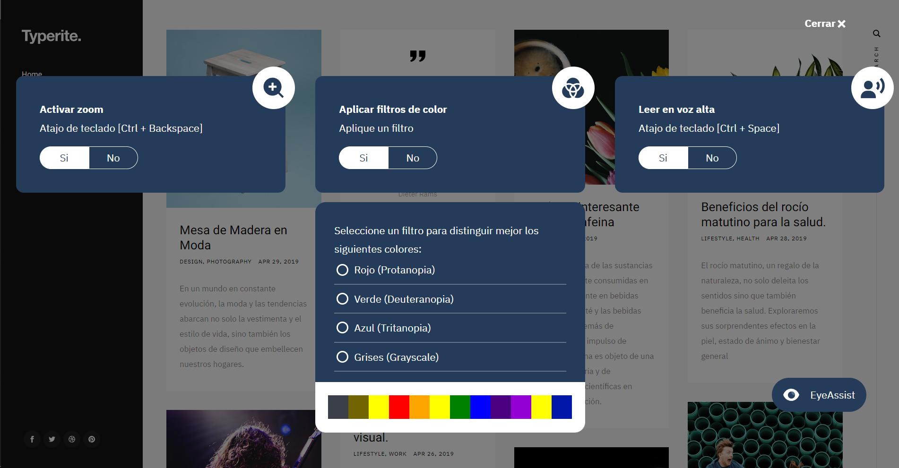

import FuncionalityCard from './components/funcionality/FuncionalityCard.astro';
import FloatText from './components/float-text/FloatText.astro';
import VideoSequence from './components/video-sequence/VideoSequence.astro';

## Interfaz principal

Eyeassist sigue las directrices WCAG para la implementación de su interfaz. Para garantizar su accesibilidad.

## Discapacidades que cubrimos
Eyeassist ofrece las siguientes características para facilitar la accesibilidad de las personas que entran en el código de clasificación CIE11 9D90 Deficiencia visual, incluida la ceguera y el código 9D44 Deficiencia de la visión de los colores.

## Herramientas gratuitas y discapacidades que cubren

Eyeassist es una biblioteca de código abierto que proporciona las siguientes funcionalidades, dependiendo del tipo de discapacidad visual que tenga el usuario.

  

    

      <ul>
          #### 9D90.1 Deterioro leve de la visión
          #### 9D90.7 Deterioro de la visión de cerca
      </ul>
    

    

        <FuncionalityCard title='Zoom' description="Activación del zoom de pantalla con el atajo [Ctrl + Retroceso]." tool="zoom"></FuncionalityCard>
    

  

  

    

      <ul>
          #### 9D44 Deterioro de la visión cromática
          #### - Protanopia
          #### - Deuteranopia
          #### - Tritanopia
      </ul>
    

    

        <FuncionalityCard title='Filters' description="Aplicación de filtros para la mejora del contraste." tool="filter"></FuncionalityCard>
    

  

  

    

      <ul>
           #### 9D90.2 Deficiencia visual moderada
           #### 9D90.3 Deterioro grave de la visión
           #### 9D90.6 Ceguera
      </ul>
    

    

        <FuncionalityCard title='ScreenReader' description="Active un lector de pantalla con el atajo [Ctrl + Espacio]." tool="reader"></FuncionalityCard>
    

  

## Herramientas premium para la ceguera

Eyeassist ofrece generacion de descripciones para contenido multimedia. 

## Genera descripciones de imagenes
Con el apoyo de bibliotecas como Salesforce-Lavis y el modelo Blip2 preentrenado, podemos generar descripciones de contenidos multimedia para proporcionar accesibilidad a las personas con discapacidad visual.

<FloatText text="Un pájaro rojo y verde sentado en lo alto de una valla de madera"></FloatText>

## Genera descripciones para videos 

Con el procesamiento de los vídeos y utilizando ia para generar la descripción de la escena podemos generar una descripción de audio de las escenas que no contiene un contexto audible.

<VideoSequence></VideoSequence>
