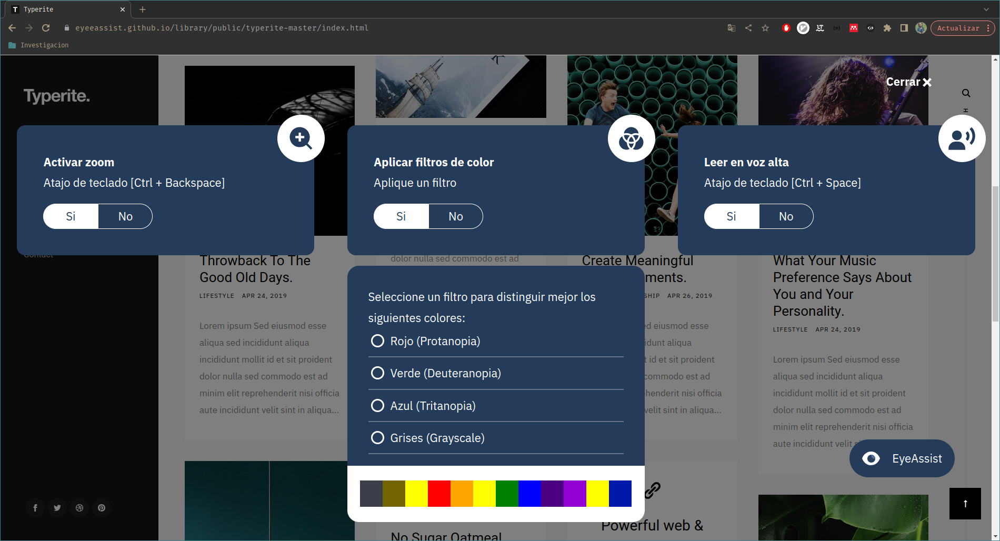

These are the functionalities that the library has, which can be activated through the following keyboard shortcuts:

| Functionality                | Shortcuts          |
|------------------------------|--------------------|
| Enable zoom                  | Ctrl + Backspace   |
| Disable zoom                 | Ctrl + Backspace   |
| Enable screen reader         | Ctrl + Space       |
| Disable screen reader        | Ctrl + Space       |
| Move to the next content     | Ctrl + Arrow Right |
| Move to the prev content     | Ctrl + Arrow left  |
| Move to the next link        | Ctrl + Enter       |
| Click on selected link       | Enter              |
| Reread the content           | Backspace          |
| Cut off the reader's readin  | Esc                |

To display the drop-down menu, click and select the type of tools that suits your needs

